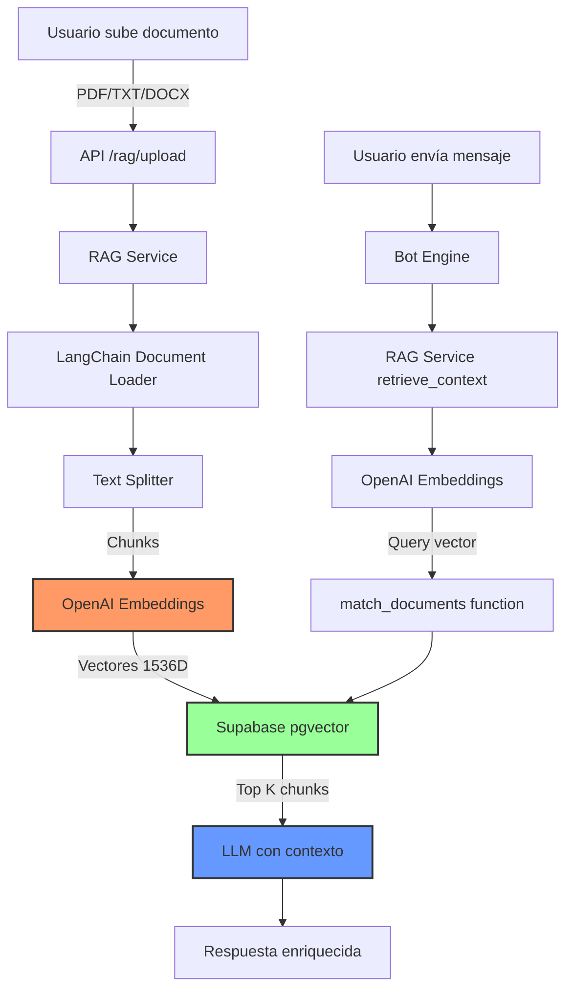

# 🚀 Supabase RAG Setup - Guía Completa

## 📋 Resumen

Tu sistema RAG ya tiene soporte para Supabase integrado en el código, pero está deshabilitado porque:
1. ❌ No existe la tabla `documents` en Supabase
2. ❌ Falta la variable de entorno `SUPABASE_SERVICE_KEY`

Esta guía te mostrará cómo habilitarlo en **5 minutos**.

---

## ✅ Ventajas de usar Supabase pgvector

| Característica | ChromaDB | Supabase pgvector |
|---------------|----------|-------------------|
| **Instalación** | Requiere Visual C++ Build Tools | ✅ Ya instalado |
| **Mantenimiento** | Servicio separado | ✅ Misma base de datos |
| **Escalabilidad** | Local/limitado | ✅ Cloud nativo |
| **Backup** | Manual | ✅ Automático |
| **Costo** | Gratis | ✅ Gratis (tier gratuito) |

---

## 🔧 Paso 1: Habilitar pgvector en Supabase

### 1.1 Abrir Supabase SQL Editor

1. Ve a [Supabase Dashboard](https://supabase.com/dashboard)
2. Selecciona tu proyecto: `oveixhmndwrtymuymdxm`
3. En el menú lateral, haz clic en **SQL Editor**
4. Haz clic en **New Query**

### 1.2 Ejecutar el Script SQL

Copia y ejecuta el contenido completo de:

**Archivo**: [scripts/supabase_pgvector_schema.sql](file:///c:/Users/avali/Desktop/Proyectos/whatsapp_sales_bot/scripts/supabase_pgvector_schema.sql)

El script creará:
- ✅ Extensión `pgvector`
- ✅ Tabla `documents` con columna vectorial
- ✅ Función `match_documents()` para búsqueda de similitud
- ✅ Índices para optimizar búsquedas
- ✅ Políticas RLS
- ✅ Funciones helper

### 1.3 Verificar Resultados

Después de ejecutar, deberías ver:

```
✅ pgvector setup completed successfully!
You can now use Supabase for RAG vector search.
```

Y varias tablas de verificación mostrando:
- Extensión `vector` habilitada
- Tabla `documents` creada
- Índices creados
- Función `match_documents` disponible
- Política RLS habilitada

---

## 🔑 Paso 2: Configurar Variables de Entorno

### 2.1 Obtener SUPABASE_SERVICE_KEY

1. En Supabase Dashboard, ve a **Settings** > **API**
2. Copia el valor de **`service_role` key** (NO el `anon` key)
3. **IMPORTANTE**: Esta key es diferente de `SUPABASE_SERVICE_ROLE_KEY`

### 2.2 Actualizar .env

Agrega o verifica estas variables en tu archivo `.env`:

```env
# Supabase Configuration
SUPABASE_URL=https://oveixhmndwrtymuymdxm.supabase.co
SUPABASE_SERVICE_KEY=tu_service_role_key_aqui
SUPABASE_SERVICE_ROLE_KEY=tu_service_role_key_aqui  # Mismo valor

# OpenAI (necesario para embeddings)
OPENAI_API_KEY=tu_openai_api_key_aqui
```

> [!IMPORTANT]
> El RAG service busca `SUPABASE_SERVICE_KEY` (sin `_ROLE`), mientras que otros servicios usan `SUPABASE_SERVICE_ROLE_KEY`. Por seguridad, define ambas con el mismo valor.

---

## 🚀 Paso 3: Reiniciar el Servidor API

```bash
# Detén el servidor actual (Ctrl+C en la terminal)

# Reinicia:
cd apps/api
python -m uvicorn src.main:app --reload --port 8000
```

### Verificar en los Logs

Busca esta línea en los logs:

```
✅ RAG service initialized with Supabase
```

Si ves esto, ¡el RAG está habilitado! 🎉

---

## 🧪 Paso 4: Probar el Sistema RAG

### Test 1: Verificar Status

```bash
curl http://localhost:8000/rag/stats \
  -H "Authorization: Bearer YOUR_TOKEN"
```

**Resultado esperado**:
```json
{
  "enabled": true,
  "backend": "supabase",
  "status": "connected"
}
```

### Test 2: Subir un Documento

**Opción A: Usando cURL**

```bash
curl -X POST http://localhost:8000/rag/upload \
  -H "Authorization: Bearer YOUR_TOKEN" \
  -F "files=@/path/to/document.pdf"
```

**Opción B: Usando el Frontend**

1. Abre http://localhost:3000
2. Ve a **Configuración** > **RAG**
3. Sube un archivo PDF o TXT
4. Deberías ver: "✅ 1 archivo(s) subido(s) correctamente (X fragmentos)"

### Test 3: Verificar en Supabase

1. Ve a **Table Editor** en Supabase
2. Abre la tabla `documents`
3. Deberías ver filas con:
   - `content`: Texto del documento
   - `metadata`: `{"source": "nombre_archivo.pdf", "chunk_index": 0}`
   - `embedding`: Vector de 1536 dimensiones

### Test 4: Probar Búsqueda RAG

1. En el chat de prueba del frontend
2. Envía un mensaje relacionado al documento que subiste
3. El bot debería usar información del documento en su respuesta
4. Revisa los logs del API para ver: "Retrieved X relevant chunks for query"

---

## 🏗️ Arquitectura del Sistema



### Flujo de Upload

1. **Usuario** sube documento (PDF/TXT/DOCX)
2. **API** guarda archivo en `./rag_uploads/`
3. **RAG Service** carga documento con LangChain loader
4. **Text Splitter** divide en chunks de ~1000 caracteres
5. **OpenAI** genera embeddings (vectores de 1536 dimensiones)
6. **Supabase** almacena chunks + embeddings en tabla `documents`

### Flujo de Retrieval

1. **Usuario** envía mensaje al bot
2. **Bot Engine** llama a `retrieve_context(query)`
3. **OpenAI** genera embedding del query
4. **Supabase** ejecuta `match_documents()` (búsqueda de similitud coseno)
5. **RAG Service** retorna top-K chunks más relevantes
6. **LLM** genera respuesta usando chunks como contexto

---

## 🔍 Troubleshooting

### Error: "RAG service is not available"

**Causa**: El servicio no se inicializó correctamente.

**Solución**:
1. Verifica que `SUPABASE_SERVICE_KEY` esté en `.env`
2. Verifica que `OPENAI_API_KEY` esté en `.env`
3. Revisa los logs del servidor para ver el error específico
4. Reinicia el servidor

### Error: "relation 'documents' does not exist"

**Causa**: No ejecutaste el script SQL en Supabase.

**Solución**:
1. Ve a Supabase SQL Editor
2. Ejecuta `scripts/supabase_pgvector_schema.sql`
3. Verifica que la tabla `documents` aparezca en Table Editor

### Error: "function match_documents does not exist"

**Causa**: El script SQL no se ejecutó completamente.

**Solución**:
1. Ejecuta el script SQL completo de nuevo
2. Verifica con: `SELECT routine_name FROM information_schema.routines WHERE routine_name = 'match_documents';`

### Los documentos se suben pero no se usan en el chat

**Causa**: El bot no está configurado para usar RAG.

**Solución**:
1. Verifica que el bot esté usando el `RAGService`
2. Revisa los logs para ver si `retrieve_context()` se está llamando
3. Verifica que el prompt del sistema incluya instrucciones para usar el contexto

### Embeddings muy lentos

**Causa**: OpenAI API puede ser lento para documentos grandes.

**Solución**:
1. Reduce el tamaño de los chunks (actualmente 1000 caracteres)
2. Procesa documentos en background
3. Considera usar un modelo de embeddings más rápido

---

## 📊 Funciones Disponibles

### API Endpoints

| Endpoint | Método | Descripción |
|----------|--------|-------------|
| `/rag/upload` | POST | Subir documentos |
| `/rag/files` | GET | Listar archivos subidos |
| `/rag/files/{filename}` | DELETE | Eliminar archivo |
| `/rag/stats` | GET | Estadísticas del RAG |
| `/rag/clear` | DELETE | Limpiar todos los documentos |

### SQL Functions

```sql
-- Obtener conteo de documentos
SELECT get_documents_count();

-- Limpiar todos los documentos
SELECT clear_all_documents();

-- Búsqueda manual de similitud
SELECT * FROM match_documents(
    query_embedding := '[0.1, 0.2, ...]'::vector,
    match_count := 5
);
```

---

## 🎯 Mejoras Futuras

### 1. Metadata Filtering

Puedes filtrar búsquedas por metadata:

```python
# En el código
results = vector_store.similarity_search(
    query="pregunta",
    k=5,
    filter={"source": "producto_manual.pdf"}
)
```

### 2. Hybrid Search

Combinar búsqueda vectorial con búsqueda de texto completo:

```sql
-- Agregar índice de texto completo
CREATE INDEX documents_content_fts_idx 
ON documents 
USING GIN (to_tsvector('spanish', content));
```

### 3. Reranking

Usar un modelo de reranking para mejorar resultados:

```python
from langchain.retrievers import ContextualCompressionRetriever
from langchain.retrievers.document_compressors import CohereRerank
```

### 4. Document Management UI

Crear interfaz para:
- Ver documentos subidos
- Eliminar documentos específicos
- Ver chunks de cada documento
- Estadísticas de uso

---

## 📚 Referencias

- [Supabase pgvector Documentation](https://supabase.com/docs/guides/ai/vector-columns)
- [LangChain SupabaseVectorStore](https://python.langchain.com/docs/integrations/vectorstores/supabase)
- [OpenAI Embeddings](https://platform.openai.com/docs/guides/embeddings)
- [pgvector GitHub](https://github.com/pgvector/pgvector)

---

## ✅ Checklist de Implementación

- [ ] Ejecutar `supabase_pgvector_schema.sql` en Supabase SQL Editor
- [ ] Verificar que tabla `documents` existe
- [ ] Verificar que función `match_documents` existe
- [ ] Agregar `SUPABASE_SERVICE_KEY` a `.env`
- [ ] Verificar `OPENAI_API_KEY` en `.env`
- [ ] Reiniciar servidor API
- [ ] Verificar en logs: "RAG service initialized with Supabase"
- [ ] Probar endpoint `/rag/stats`
- [ ] Subir documento de prueba
- [ ] Verificar documento en Supabase Table Editor
- [ ] Probar búsqueda en el chat
- [ ] Verificar que el bot usa contexto del documento

---

**¡Listo!** Tu sistema RAG ahora usa Supabase pgvector 🎉
